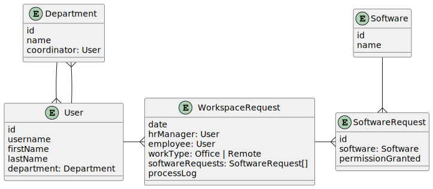

# Jmix Commercial Add-ons Demo

This project includes the following Jmix commercial add-ons:

- [BPM](https://www.jmix.io/marketplace/bpm/)
- [Business Calendars](https://www.jmix.io/marketplace/business-calendars/)
- [WebDAV](https://www.jmix.io/marketplace/webdav/)
- [Maps](https://www.jmix.io/marketplace/maps/)
- [Notifications](https://www.jmix.io/marketplace/notifications/)

## Demo Data and Process

The project contains the data model, UI and BPMN definition demonstrating the process of preparing the workspace for new employees. The process involves functionality of BPM add-on.

The data model consists of the following entities:

When you start the application for the first time, it automatically deploys the `Workspace preparation` process and creates the following users:

- `[admin]` - the standard admin with full rights to the application. However, he cannot start the workspace preparation process.
- `Alice Brown [alice]` - has `HR Manager` role, can start the workspace preparation process and check completed requests.
- `Robert Taylor [bob]` - has `System Administrator` role, can define software systems in the application and grant permissions to them.
- `Linda Evans [linda]` - has `Coordinator` role and is set as coordinator for the `Operations` department. Can allocate physical workspace for new employees working in the office.
- `Susan Baker [susan]` - a new employee. Just a user, doesn't have access to any system activity mentioned above.

All users except `admin` have password `1`. The `admin` user has `admin` password.

Below is a brief description of the [business process](doc/workspace-preparation-process.png) of a workspace preparation for a new employee: 

- The HR Manager creates a new request for an employee and starts the process by clicking a button in the _Workspace requests_ view.
- The process creates a user task for a System Administrator. The user task opens the _Software requests_ view, allowing the System Administrator to add `SoftwareRequest` records indicating permitted software to the `WorkspaceRequest` entity. After the task is complete, the process writes a log message to the `WorkspaceRequest` about granted permissions.
- If the work type is `Office`, then the process creates a user task for a Coordinator of the employee's department. The user task opens a dialog where the coordinator enters a workspace description: where it is located, etc. After the task is complete, the process writes a log message to the `WorkspaceRequest` entity with the workspace description.
- If the work type is `Remote`, the process doesn't create any task for a Coordinator and goes straight to join with the System Administrator branch.
- When tasks in both branches are finished, the process creates a user task for the HR Manager to check the completed request. The task shows the _Review workspace request_ view.
- After the HR Manager completes the `Check request` task, the process ends.

## Demo Scenario

1. Run the application
2. Login as `alice` with password `1`. You are an HR manager and you can start workspace preparation processes.
   1. Open _Application -> Workspace requests_
   2. Click _Start workspace preparation process_ button
   3. Select `susan` in _Employee_ field and `Office` in _Work type_ field
   4. Click _OK_
3. Login as `bob` with password `1`. You are a system administrator and you can grant permissions to software systems.
   1. Open _BPM -> My tasks_
   2. Select `Grant system permissions` in the left panel and open the task in the right panel
   3. In the _Software requests_ window, create a few software request items. In the edit screen of each item, select a software system and tick the _Permission granted_ checkbox. Then click _OK_ in _Software requests_ window.
4. Login as `linda` with password `1`. You are a coordinator and you can allocate physical workspace for office workers.
   1. Open _BPM -> My tasks_
   2. Select `Allocate workspace` in the left panel and open the task in the right panel
   3. Enter a workspace description in the _Allocate workspace_ dialog, then click _Complete task_
5. Login as `alice` again. 
   1. Open _BPM -> My tasks_
   2. Select `Check request` in the left panel and open the task in the right panel
   3. Review the _Process log_ field and click _OK_
